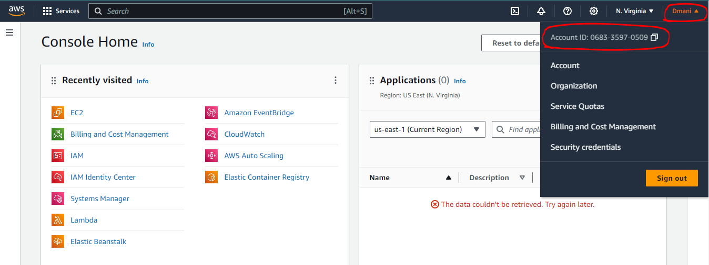
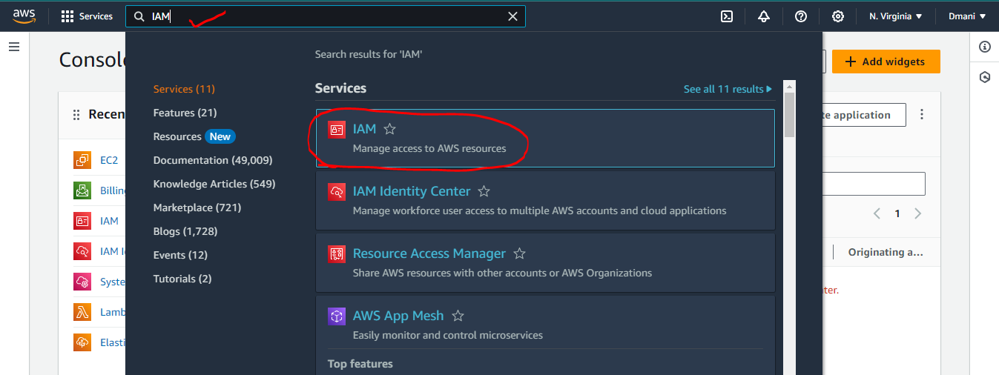
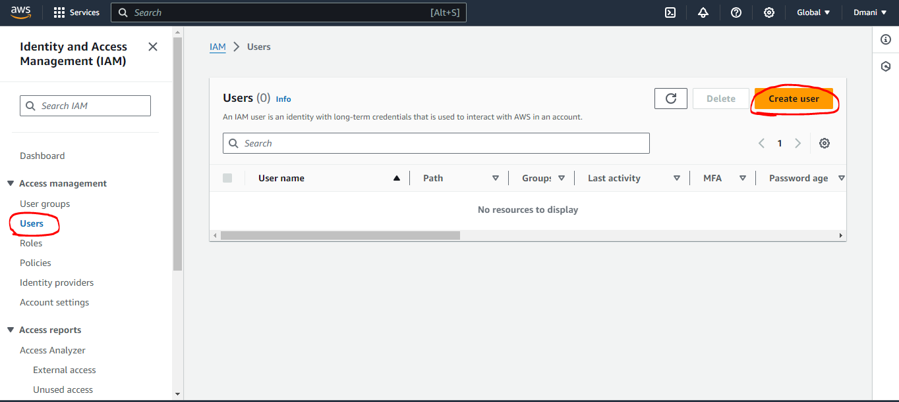
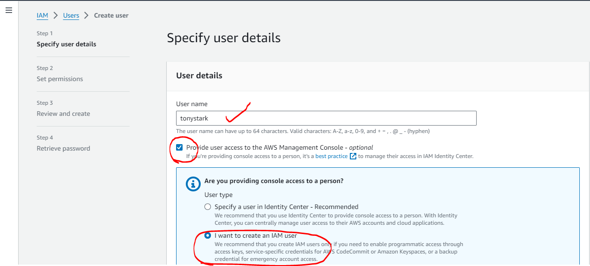
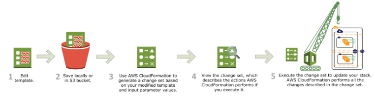
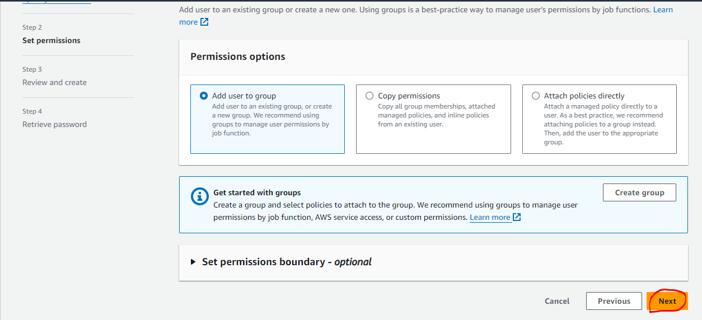

## AWS Accounts and Challenges

* To use _**AWS**_ you require an `AWS Account`
* AWS Account `Types` and `support plans`
    * _**Free Tier Account**_ :

        [ Refer here : https://aws.amazon.com/free/?all-free-tier.sort-by=item.additionalFields.SortRank&all-free-tier.sort-order=asc&awsf.Free%20Tier%20Types=*all&awsf.Free%20Tier%20Categories=*all ]

    * _**Support plans**_ :

        [Refer here : https://aws.amazon.com/premiumsupport/plans/ ]

        * Developer
        * Business
        * Enterprise RAMup
        * Enterprise

* When we create an AWS account for learning purposes, we have full access as we created the account ( _**root account**_ )
* Whereas in Enterprises, an AWS account is used by multiple employees and you will be one of the user of your organizational account


* To give access to the employees and set restrictions on what is allowed or denied, we need to implement _**Authentication and Authorization**_
* How organizations in `non aws/cloud world` store their user information (Identity Server) and how do we connect that to AWS (Federation)
* How to enforce Standards ?
* Service Accounts in AWS
* Generally organizations use multiple AWS accounts and in many cases we do the same _**Identity and Access Control**_ related works so how to reuse
* To Acheive the above, we need to deal with the following
    * IAM
    * Organizations and Control Tower
    * AD Sync or Federations
* Skills required:
    * JSON
    * CLI
    * Basic resources creation

## Identity and Access Management

* _**Root Account**_ : Root Account refers to the super user in AWS with access to everything including bills
* AWS can be accessed via :
    * Console Access:
        * This refers to accessing aws from https://console.aws.amazon.com/
        * Here we login with `Username` and `Password`
    * Programmatic Access:
        * This refers to accessing aws from terminal (by typing commands) and sdk (by writing code)
        * To login into aws we need _**Secret key**_ and _**Access key**_

    

* Every AWS account will have `Unique account Id`


* For everything you create in AWS will have unique _**ARN (Amazon Resource Name)**_
* Who can login into AWS? 
    * Users (_**IAM Users**_)
    * Applications
* Sometimes we might give access to an AWS Resource to access other AWS resources (_**IAM Roles**_)
* In _**AWS Authorization**_ is provided by _**IAM Policies**_
* In AWS we have two kinds of policies :
    * _**AWS Managed Policies**_ : Policies written by AWS which are available for usage in all AWS Accounts
    * _**Customer Managed Policies**_ : These are created and maintained by Customers

### Let's create a user( IAM User ) to access console

* Navigate to IAM :


* Don't give any policies


* Let's login => Navigate to console in other browser or incognito

    [Refer here : https://signin.aws.amazon.com/signin?redirect_uri=https%3A%2F%2Fconsole.aws.amazon.com%2Fconsole%2Fhome%3FhashArgs%3D%2523%26isauthcode%3Dtrue%26state%3DhashArgsFromTB_eu-north-1_6d9bb532fc2d1743&client_id=arn%3Aaws%3Asignin%3A%3A%3Aconsole%2Fcanvas&forceMobileApp=0&code_challenge=VDgSAikxnC1TX8UHJBP2iTE2GTqSgr03tIm8iuYb3TA&code_challenge_method=SHA-256 ]


* Root user has access to every thing


* The user `tony stark` doesnot have _**authorization**_
* Now let's try to give `tonystark` some permissions by `attaching policies`


### Exercise

* Create two IAM users _**(dev1, dev2)**_ and attach both of them to `AmazonEC2FullAccess Policy`
* Create two IAM users _**(test1, test2)**_ and attach both of them to `AmazonEC2ReadOnlyAccess Policy`
* Login with all the four credentails and verify the access
* Create two user groups _**developers**_ with `AmazonEC2FullAccess policy` and _**testers**_ with `AmazonEC2ReadOnlyAccess`


* This approach is useful for giving access based on user roles in your organization
* Best Practice is to give :
    * Common permissions at group level
    * Specific permissions at user level
* AWS Policies either allow or deny access

* AWS supports two types of block storage (for `virtual hard disk storage`) :
    1. _**Elastic Block Storage**_ :
        * Mounted from a different host in Same _**AZ (Availability Zone)**_
        * This is _**Persistent Storage (Non-Ephemeral)**_
        * EBS volumes can exist even after ec2 is deleted
    2. _**Instance Storage**_ :
        * Mounted from same host
        * This is _**Volatile Storage (Ephemeral)**_ 
        * Shutdown of ec2 will wipe the data adn termination (deletion) of ec2 instance will delete the disks

    
    

* EC2 charges:
    * Charge for instance type
    * Charge for EBS volumes
    * Charge for OS (for some AMI's)
* AWS EC2 mandates all the OS disks should be EBS volumes
* Only few EC2 instance types support instance storage


### AWS EC2 Lifecycle

* Instance states



* Official doc's on instance `Life cycle` :

    [Refer here : https://docs.aws.amazon.com/AWSEC2/latest/UserGuide/ec2-instance-lifecycle.html ]

### EC2 Instance Types

* _**Instance Family**_ : This is hardware specification of Host (T, C, M etc) and then they have generations (t1, t2, t3, c1, c5)
* _**Instance Size**_ : Generally this is a multiplication factor
    * nano
    * micro
    * small
    * medium
    * large
    * xlarge
    * 2xlarge
* Instance size also speaks about networking performance
* Purpose based Instance Families :

    [Refer here : https://aws.amazon.com/ec2/instance-types/ ]



### IAM Policies

* IAM Policy is a `JSON Document`

### JSON (Java Script Object Notation)

* We use JSON to represent data
* JSON represents data in the form of `name-value` pairs
```
name           value
qualificiation Btech
course         AWS
```
* Name-value is represented in the form of `"<name>": <value>`
```
"qualificiation": Btech
"course": AWS
```
* Value can be of different types categorized into
    1. _**Simple**_ :
        * _**Text/String**_ : we use quotes
            "qualificiation": "BTech"
            "Course": "AWS"
        * _**Number**_ :
            "duration": 90
        * _**Boolean**_ : two values are possible `true or false`
            "isOnline": true
    2. _**Complex**_ :
        * _**list/array**_ : This is represented in `[]` 
            "colors": ["Red", "White"]
        * _**object/dictionary**_ : This is represented in `{ }` 
            {
            "Street": 2,
            "Building": "Nilgiri",
            "Landmark": "Ameerpet Metro",
            "City": "Hyderabad"
            }
* _**Example-1**_ : Let's write a JSON File representing movie details :
```
{
    "Name": "RRR",
    "Director": "SS Rajamouli",
    "Cast": [
        "Ram Charan",
        "NTR",
        "Alia Bhatt"
    ],
    "Budget In Crores": 550,
    "Ratings": {
        "IMDB": 7.9,
        "RottenTomatoes": 95,
        "facebook": 5
    }
}
```
* _**Example-2**_ : Write a JSON File representing your favorite holiday destination :
```
{
    "Place": "Vishakapatnam",
    "Highlights": {
        "Spots": ["RK Beach", "Bheemili", "Araku" ],
        "Food": ["Banana Delight", "Seafood"],
        "Shopping": [] 
    }
}
```
* _**Example-3**_ : Write a JSON to represent favorite subject of yours. The structure should be as follows :
```
{
    Name = Text
    When = Text (one of School, Intermediate, Graduation, PG )
    Topics = list of text
}
```
* _**Example-4**_ : Let's write some values
```
{
    "Name": "Design and Analysis of Algorithms",
    "When": "Graduation",
    "Topics": [
        "Space Complexity",
        "Time Complexity"
    ]
}
```
* Generally we would be following structure provided by AWS for `IAM Policies` :

    [Refer here : https://docs.aws.amazon.com/IAM/latest/UserGuide/reference_policies_grammar.html ]

### Writing IAM Policy

* IAM _**Policy Grammar**_

    [Refer here : https://docs.aws.amazon.com/IAM/latest/UserGuide/reference_policies_grammar.html ]

* _**Prinicipal**_ : This represents user
* _**Resource**_ : This represents a resoruce (ARN)
* _**action**_ : This defines the activities that can be done on resource
* _**effect**_ : Allow or Deny
* _**Condition**_ : Execute the permission based on some condition

### Activity-1 : Create a custom IAM Policy to Start and Stop EC2 instances

* Let's create a json file
* Version 

    [Refer Here : https://docs.aws.amazon.com/IAM/latest/UserGuide/reference_policies_elements_version.html ]

* The minimal `IAM Policy structure`
```
{
    "Version": "2012-10-17",
    "Statement": [
        {
            "Effect": "Allow",
            "Action": [],
            "Resource": []
        }
    ]
}
```
* Generally to start and stop the ec2 instace it is implicit that user should be able to view/list instnaces
* For Actions, resources, and condition keys for Amazon EC2 :

    [Refer Here : https://docs.aws.amazon.com/service-authorization/latest/reference/list_amazonec2.html ]

* For the changes :

    [Refer here : https://github.com/asquarezone/awsadministration/commit/177594de2d43d92e785891c841346addae706507 ]

### Activity-2: Create a custom IAM policy to perform any operation on EC2 but not terminate instances

* For the changes

    [Refer here : https://github.com/asquarezone/awsadministration/commit/6cda99ec36c1cffc7752b4356b181c9d83741489 ]

### Activity-3: Create a Custom IAM Policy to perform any operation on s3, rds and ec2 but stop users from terminating, stopping ec2 and rds instances and removing s3 buckets

* For changeset

    [Refer here : https://github.com/asquarezone/awsadministration/commit/2ac6be507930d2af53c57fb0bc2ffb08c89160a4 ]

### Activity-4: Create an IAM Policy to Start and Stop Ec2 instances

* Create an IAM Policy to Start and Stop Ec2 instances, if the ec2 instance is in `ap-south-1 region` and in other regions only give read permissions
* Every resource created in AWS will have unique _**ARN**_
* ARN for EC2 `arn:${Partition}:ec2:${Region}:${Account}:instance/${InstanceId}`
* To fill this 

    [Refer Here : https://docs.aws.amazon.com/IAM/latest/UserGuide/reference-arns.html ]

* In our case
```
arn:aws:ec2:ap-south-1:*:instance/*
```
* For the IAM policy

    [Refer here : https://github.com/asquarezone/awsadministration/commit/b1f1c4f665b75dcfe1b51dc0999f7a726dcf3426 ]

### Activity-5: Create an IAM Policy to allow user to delete bucket if the region is only us-west-2

* Condition keys based on Actions and then there are global condition keys 

    [Refer Here : https://docs.aws.amazon.com/IAM/latest/UserGuide/reference_policies_condition-keys.html ]

* We have condition block
* For changes

    [Refer here : https://github.com/asquarezone/awsadministration/commit/28c182ab1af86b901b46e32c334be6566947ff29 ]

* _**Exercise**_ : Create an IAM policy to give full access to ec2 in all regions but oregon

### IAM Conditions

### Activity-6: Create an IAM Policy to allow user to terminate instance if the type is t2.micro

* _**Action**_ : 
    ec2:TerminateInstances
* For the policy created

    [Refer here : https://github.com/asquarezone/awsadministration/commit/5cb283a96ce8c5f9df2fca972959da830dc4385c ]

### Activity-7: Allow user to Create ec2 instance if the type is t2.micro and region is mumbai

* Refer the policy below
```
{
    "Version": "2012-10-17",
    "Statement": [
        {
            "Effect": "Allow",
            "Action": ["ec2:*", "cloudwatch:Describe*", "elasticloadbalancing:Describe*", "autoscaling:Describe*"],
            "Resource": "*"
        },
        {
            "Effect": "Deny",
            "Action": ["ec2:RunInstances"],
            "Resource": "*",
            "Condition": {
                "StringNotEquals": {
                   "ec2:Region": "ap-south-1",
                   "ec2:InstanceType": "t2.micro"
                }
            }
        }
    ]
}
```
* This policy is not working if the region is mumbai and instance type is not t2.micro

### Resource-based policies

* These are policies for specific resources like s3 buckets, SQS etc

### IAM Roles

* Roles are permissions given to aws resources to access other aws resources

### Activity-1: Create an IAM Role for ec2 instances to have full access on s3 buckets


* Create an ec2 instance (Amazon linux) and attach the role of fulls3accesstoec2


* Now login into ec2 instance and create and delete s3 bucket


### Activity-2: Create an IAM role which allows ec2 instances to do anything on IAM


### Auditing with Cloud Trail

* Cloud Trail tracks aws account usage


* Exercise:
    * Create two users with ec2 full access
    * Create two ec2 instances
        * login as user 1 and shutdown one ec2
        * login as user 2 and terminate one ec2
* Login in as user 1 and check cloud trail
* Login in as user 2 and check cloud trail
* Login in as root and check cloud trail

### Multiple Account Management via AWS Organizations

* AWS Organizations let us manage and govern multiple accounts from one place


* Service Control Policies 

    [Refer Here : https://docs.aws.amazon.com/organizations/latest/userguide/orgs_manage_policies_scps.html ]

* For scp syntax

    [Refer here : https://docs.aws.amazon.com/organizations/latest/userguide/orgs_manage_policies_scps_syntax.html ]
    
* For ec2 sample

    [Refer here : https://docs.aws.amazon.com/organizations/latest/userguide/orgs_manage_policies_scps_examples_ec2.html ] 
    
* For tagging samples

    [Refer here : https://docs.aws.amazon.com/organizations/latest/userguide/orgs_manage_policies_scps_examples_tagging.html ]

### AWS Access Analyzer

* Create an OU with Called Learning and add your aws account under that
* Go to IAM Access Analyzers and add new analyzer for OU   

### Infrastructure as Code (IaC)

* This represents expressing infra as a Desired state and let the IaC tool do the rest
* Popular IaC tools
    * Terraform
    * Cloud Formation
    * ARM Templates
    * Azure Bicep

### AWS Cloudformation

* AWS Cloudformation, allows us to express the desired state in `JSON or YAML` format and when executed (Created stack) will create infra
* Workflow :
    * Author a template
    * upload to s3 directly or indirectly
    * Creates changeset (what has to be created/updated)
    * Executes to realize infra



* For CF concepts

    [Refer here : https://docs.aws.amazon.com/AWSCloudFormation/latest/UserGuide/cfn-whatis-concepts.html ]

* _**Template**_ : Desired state expressed in JSON or YAML
* _**Stack**_ : Represents the execution of Template
* _**Changeset**_ : This represents the infra to be updated/created/deleted.
* To author an Cloud formation template, we need :
    * JSON/YAML Knowledge
    * Manual steps for how to create infra
    * Productivity:
        * Visual Studio Code with Cloud formation extension


## Cloud formation Template Grammar/Syntax

* For AWS CF Template syntax

    [Refer here : https://docs.aws.amazon.com/AWSCloudFormation/latest/UserGuide/template-anatomy.html ]

* JSON
```
{
  "AWSTemplateFormatVersion" : "version date",

  "Description" : "JSON string",

  "Metadata" : {
    template metadata
  },

  "Parameters" : {
    set of parameters
  },

  "Rules" : {
    set of rules
  },

  "Mappings" : {
    set of mappings
  },

  "Conditions" : {
    set of conditions
  },

  "Transform" : {
    set of transforms
  },

  "Resources" : {
    set of resources
  },

  "Outputs" : {
    set of outputs
  }
}
```
* YAML
```
---
AWSTemplateFormatVersion: "version date"

Description:
  String

Metadata:
  template metadata

Parameters:
  set of parameters

Rules:
  set of rules

Mappings:
  set of mappings

Conditions:
  set of conditions

Transform:
  set of transforms

Resources:
  set of resources

Outputs:
  set of outputs
```
* Template sections 

    [Refer Here : https://docs.aws.amazon.com/AWSCloudFormation/latest/UserGuide/template-anatomy.html#template-anatomy-sections ]

* For now let's look at three template sections :
    
    1. Format Version: 
    
    [Refer Here : https://docs.aws.amazon.com/AWSCloudFormation/latest/UserGuide/format-version-structure.html ]

    2. Description 
    
    [Refer Here : https://docs.aws.amazon.com/AWSCloudFormation/latest/UserGuide/template-description-structure.html ]

    3. Resources 
    
    [Refer Here : https://docs.aws.amazon.com/AWSCloudFormation/latest/UserGuide/resources-section-structure.html ]

* Skeleton(JSON):
```
{
    "AWSTemplateFormatVersion": "2010-09-09",
    "Description": "",
    "Resources": {

    }
}
```
* Skeleton (YAML):
```
---
AWSTemplateFormatVersion: '2010-09-09'
Description: ''
Resources: {}
```
### Activity-1: Create an S3 bucket using Cloud formation

* Way of Working (WoW):
    * Manual steps for creation
    * Let's make a note of inputs which we provide while creating s3 bucket
* Manual Steps:


* Search for resource type and syntax


* s3 resource in cloud formation 

    [Refer Here : https://docs.aws.amazon.com/AWSCloudFormation/latest/UserGuide/aws-resource-s3-bucket.html ]

* For the template created

    [Refer here : https://github.com/asquarezone/awsadministration/commit/9e251a96bc6a840265eac7e850020634a6925bb3 ]

* Create stack:


### Activity-2: Create a VPC

* For manual steps

    [Refer here : https://directdevops.blog/2023/03/17/devops-classroomnotes-17-mar-2023/ ]

* Inputs
    * Name tag
    * cidr: 192.168.0.0/16
* Create stack from the template


### Exercise :

* Create a cloud formation template to :
    * Create a user in IAM
    * Create a group in IAM

## AWS Cloud formation
### Overall architecture

* Overview



### Create VPC

* For the changes done

    [Refer here : https://github.com/asquarezone/awsadministration/commit/446019c53c0abd2840f5f2183bfb905c066ab89e#diff-88dfb32faa4e9964e5eaaea431c705d18c5e1731888b578caf2eeb955795d92d ]

* Create a stack


* Let's define parameters to make CIDR range of VPC dynamic, for parameters official doc's

    [Refer here : https://docs.aws.amazon.com/AWSCloudFormation/latest/UserGuide/parameters-section-structure.html ]

* To use the parameter use `ref function`, for the changeset

    [Refer here : https://github.com/asquarezone/awsadministration/commit/4337cc5e4467bb469b0f3d149a5e2e978de96392 ]

* Updating the properties might lead to
    * _**Replacement**_ : Delete and recreate
    * _**No Interuption**_ : Modify on existing resource
* Let's add subnets
    * For the changes done to add web1 subnet

    [Refer here : https://github.com/asquarezone/awsadministration/commit/60a3ad1b4c43386fbbb16e488873d734b6ba1fa2 ]

    * Now update the stack


* For the changes done to add 3 more subnets

    [Refer here : https://github.com/asquarezone/awsadministration/commit/8f943203821c08e1818e1e70fe5227de3a2566ec ]


* web1, db1 subnets should be in AZ-a and web2, db2 subnets should be in AZ-b
* Cloud formation supports AWS specific parameter types
* Use AZ parameter as done in this changeset

    [Refer here : https://github.com/asquarezone/awsadministration/commit/daa16933df0b0327719dfec27af6cf6edf30c55d ]

### Database Creation from Cloudformation

* To Create rds database we need to create
    * dbsubnet group: where we select subnets to create rds instance
    * security group:
        * mysql:
            * incoming/ingress:
                * port: 3306
                * cidr: vpc cidr
* For the changes done

    [Refer here : https://github.com/asquarezone/awsadministration/commit/4b03bbab2650d11716d5ba7573095adf644c6dbf ]


* Exercise: Try adding parameters for
    * portno
    * engine: mysql,postgres
    * dbinstance name:
    * dbinstance class
    * dbsize:
    * dbtype
* For the parameter engine added

    [Refer here : https://github.com/asquarezone/awsadministration/commit/26decca3acb8fb465b57b66846c4e17e3645e5c8 ]

### Creating ec2 instance using Cloudformation

* We will be installing apache server in ubuntu 22.04
* Things to be created
    * Security group with 22 and 80 port opened to all. For the changes done

    [Refer here : https://github.com/asquarezone/awsadministration/commit/82d6001da630c1927aec21df977edd38db6f2869 ]

* Things to be figured out
    * AMI id of ubuntu22.04:
    * key pair to be passed
    * instance type to passed
    * subnet in which ec2 instance has to be created
* Let's create ec2 based on Refer Here cloudformation spec
* For the changes done.

    [Refer here : https://github.com/asquarezone/awsadministration/commit/79360f7f8fda5a36eb7d4ba507fde789da58bd21 ]
    
* This created an ec2 instance but it didn’t had public ip address