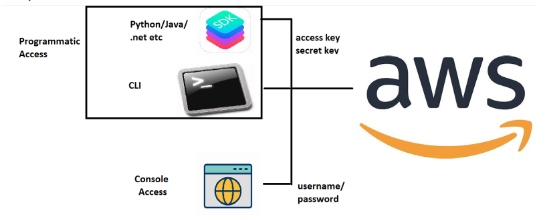

## AWS Accounts and Challenges

* To use _**AWS**_ you require an `AWS Account`
* AWS Account `Types` and `support plans`
    * _**Free Tier Account**_ :

        [ Refer here : https://aws.amazon.com/free/?all-free-tier.sort-by=item.additionalFields.SortRank&all-free-tier.sort-order=asc&awsf.Free%20Tier%20Types=*all&awsf.Free%20Tier%20Categories=*all ]

    * _**Support plans**_ :

        [Refer here : https://aws.amazon.com/premiumsupport/plans/ ]

        * Developer
        * Business
        * Enterprise Ramup
        * Enterprise

* When we create an AWS account for learning purposes, we have full access as we created the acount (root account)
* Whereas in Enterprises, An AWS account is used by multiple employees and you will be one of the user of your organizational account

* To give access to the employees and set restrictions on what is allowed or denied, we need to implement Authentication and Authorization
* How organizations in non aws/cloud world store their user information (Identity Server) and how do we connect that to AWS (Federation)
* How to enforce Standards ?
* Service Accounts in AWS
* Generally organizations use multiple AWS accounts and in many cases we do the same Identity and Access Control related works so how to reuse
* To Acheive the above, we need to deal with the following
    * IAM
    * Organizations and Control Tower
    * AD Sync or Federations
* Skills required:
    * JSON
    * CLI
    * Basic resources creation

## Identity and Access Management

* _**Root Account**_ : Root Account refers to the super user in AWS with access to everything including bills
* AWS can be accessed via :
    * Console Access:
        * This refers to accessing aws from https://console.aws.amazon.com/
        * Here we login with username and password
    * Programmatic Access:
        * This refers to accessing aws from terminal (by typing commands) and sdk (by writing code)
        * To login into aws we need secret key and access key

    

* Every AWS account will have unique account id

* For everything you create in AWS will have unique ARN (Amazon Resource Name)
* Who can login into AWS? (IAM Users)
    * Users
    * Applications
* Sometimes we might give access to an AWS Resource to access other AWS resources (IAM Roles)
* In AWS Authorization is provided by IAM Policies
* In AWS we have two kinds of policies
    * AWS Managed Policies: Policies written by AWS which are available for usage in all AWS Accounts
    * Customer Managed Policies: These are created and maintained by Customers

### Let's create a user to access console

* Navigate to IAM

* Dont give any policies

* Lets login, Navigate to console in other browser or incognito

    [Refer here : https://signin.aws.amazon.com/signin?redirect_uri=https%3A%2F%2Fconsole.aws.amazon.com%2Fconsole%2Fhome%3FhashArgs%3D%2523%26isauthcode%3Dtrue%26state%3DhashArgsFromTB_eu-north-1_6d9bb532fc2d1743&client_id=arn%3Aaws%3Asignin%3A%3A%3Aconsole%2Fcanvas&forceMobileApp=0&code_challenge=VDgSAikxnC1TX8UHJBP2iTE2GTqSgr03tIm8iuYb3TA&code_challenge_method=SHA-256 ]

* Root user has access to every thing

* The user tony stark doesnot have authorization
* Now let's try to give tonystark some permissions by attaching policies

### Exercise

* Create two IAM users (dev1, dev2) and attach both of them to AmazonEC2FullAccess Policy
* Create two IAM users (test1, test2) and attach both of them to AmazonEC2ReadOnlyAccess Policy
* Login with all the four credentails and verify the access
* Create two user groups developers with AmazonEC2FullAccess policy and testers with AmazonEC2ReadOnlyAccess

* This approach is useful for giving access based on user roles in your organization
* Best Practice is to
    * Give common permissions at group level
    * Specific permissions at user level
* AWS Policies either allow or deny access