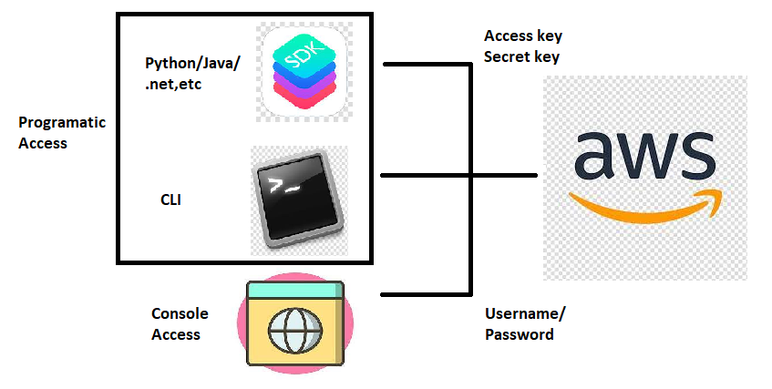
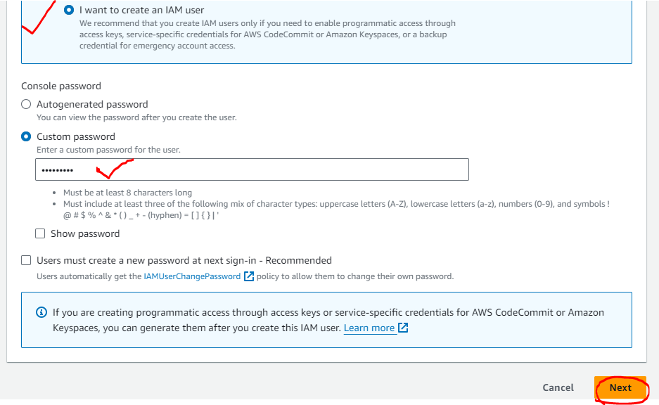
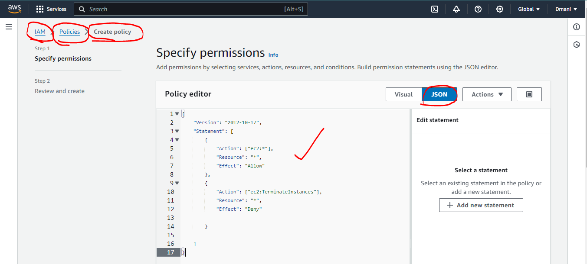
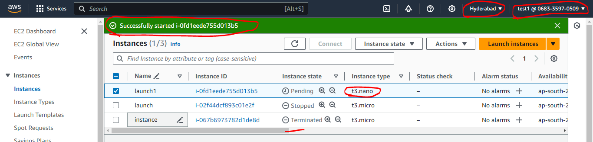
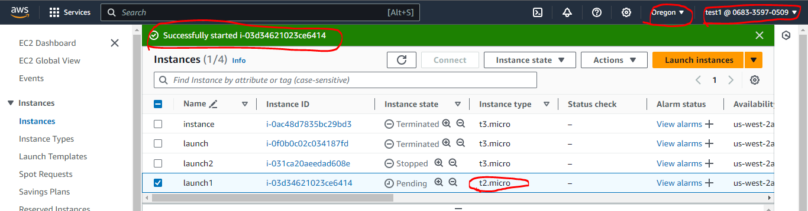
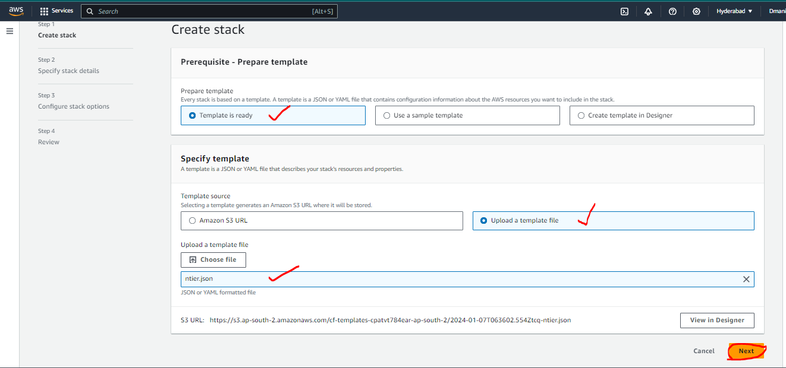
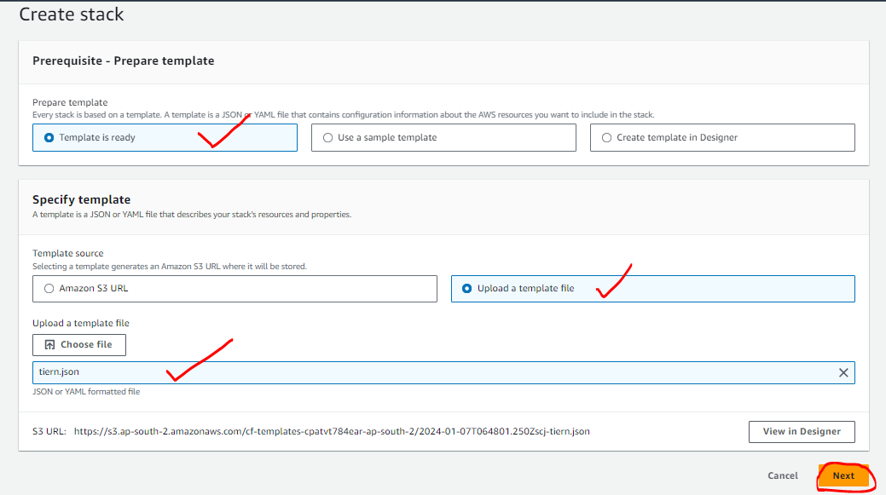
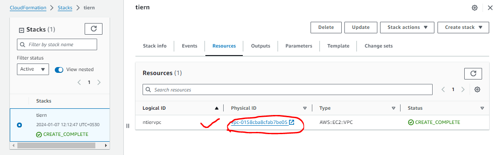
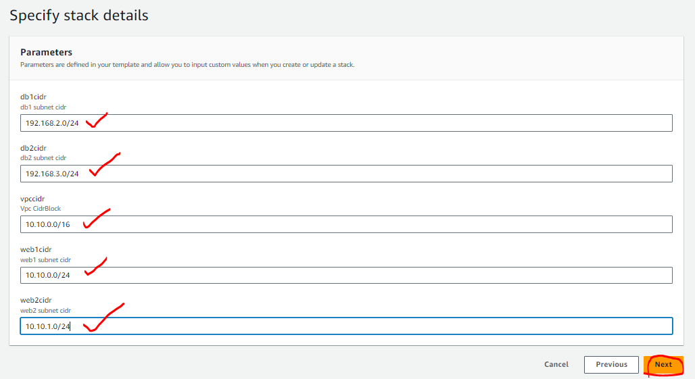
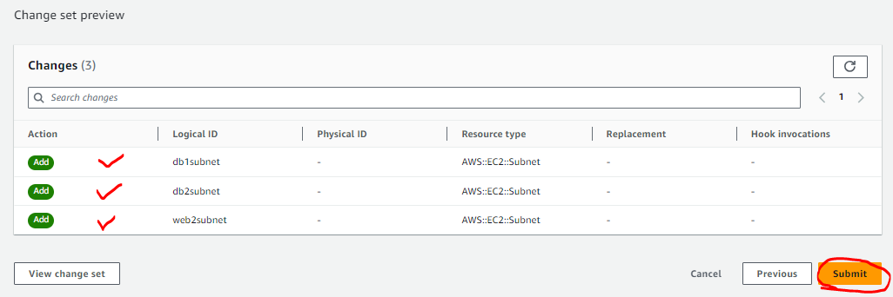

## AWS Accounts and Challenges

* To use _**AWS**_ you require an `AWS Account`
* AWS Account `Types` and `support plans`
    * _**Free Tier Account**_ :

        [ Refer here : https://aws.amazon.com/free/?all-free-tier.sort-by=item.additionalFields.SortRank&all-free-tier.sort-order=asc&awsf.Free%20Tier%20Types=*all&awsf.Free%20Tier%20Categories=*all ]

    * _**Support plans**_ :

        [Refer here : https://aws.amazon.com/premiumsupport/plans/ ]

        * Developer
        * Business
        * Enterprise RAMup
        * Enterprise

* When we create an AWS account for learning purposes, we have full access as we created the account ( _**root account**_ )
* Whereas in Enterprises, an AWS account is used by multiple employees and you will be one of the user of your organizational account


* To give access to the employees and set restrictions on what is allowed or denied, we need to implement _**Authentication and Authorization**_
* How organizations in `non aws/cloud world` store their user information (Identity Server) and how do we connect that to AWS (Federation)
* How to enforce Standards ?
* Service Accounts in AWS
* Generally organizations use multiple AWS accounts and in many cases we do the same _**Identity and Access Control**_ related works so how to reuse
* To Acheive the above, we need to deal with the following
    * IAM
    * Organizations and Control Tower
    * AD Sync or Federations
* Skills required:
    * JSON
    * CLI
    * Basic resources creation

## Identity and Access Management

* _**Root Account**_ : Root Account refers to the super user in AWS with access to everything including bills
* AWS can be accessed via :
    * Console Access:
        * This refers to accessing aws from https://console.aws.amazon.com/
        * Here we login with `Username` and `Password`
    * Programmatic Access:
        * This refers to accessing aws from terminal (by typing commands) and sdk (by writing code)
        * To login into aws we need _**Secret key**_ and _**Access key**_

    

* Every AWS account will have unique `Account Id`

  

* For everything you create in AWS will have unique _**ARN (Amazon Resource Name)**_

* Who can login into AWS? (_**IAM Users**_)
    * Users 
    * Applications
* Sometimes we might give access to an AWS Resource to access other AWS resources (_**IAM Roles**_)
* In AWS _**Authorization**_ is provided by _**IAM Policies**_
* In AWS we have two kinds of policies :
    1. _**AWS Managed Policies**_ : Policies written by AWS which are available for usage in all AWS Accounts
    2. _**Customer Managed Policies**_ : These are created and maintained by Customers

### Let's create a user( IAM User ) to access console

* Navigate to IAM :

  

=> Users=> Create user


=> Username : tonystark => provide access => want to create IAM user


=> Custom password : Tony@stark => Next



* Don't give any policies => Next => Create user


* Let's login => Navigate to console in  incognito with the link got created for the user with credentials created

    [Refer here : https://068335970509.signin.aws.amazon.com/console]


* Root user has access to every thing,but IAM user cannot access the same as no policies given


* The user `tony stark` doesnot have _**authorization**_ , so nothing can be created also with the user login


* Now let's try to give `tonystark` some permissions by `attaching policies`

=> Go to root user => Navigate to IAM => Users => select the `tonystark` user => select Add permissions


=> Attach policies directly => AmazonS3FullAccess => Next => Add permissions


* Now after giving the permissions it gives access to the resources already created ( and this only works for the permissions of resources given not for all the resources of root account )


### Exercise

* Create two IAM users _**(dev1, dev2)**_ and attach both of them to `AmazonEC2FullAccess Policy`
* Create two IAM users _**(test1, test2)**_ and attach both of them to `AmazonEC2ReadOnlyAccess Policy`
* Login with all the four credentails and verify the access

[ _**NOTE**_ : Instead of doing lengthy with 4 users we create groups as follows for similar permissions given users to simplify the process ]

* Create two user groups _**developers**_ with `AmazonEC2FullAccess policy` and _**testers**_ with `AmazonEC2ReadOnlyAccess`

=> User groups => group name => attach policy by searching => Create group


* Now create users ( dev1, dev2, test1, test2 ) adding them to the respective groups with the policies required


* This approach is useful for giving access based on user roles in your organization
* Best Practice is to give :
    * Common permissions at group level
    * Specific permissions at user level
    * AWS Policies either allow or deny access

### AWS Managed Policies

* Policies given aws by default are referred as Managed Policies
* These are generic policies created and managed by aws


### AWS Customer Managed Policies

* These are custom policies defined by AWS USers for custom permissions.
* To Create Policies we need to understand
    * Service
    * Resource
    * Actions

* For the Actions, services and condition keys

    [Refer here : https://docs.aws.amazon.com/service-authorization/latest/reference/reference_policies_actions-resources-contextkeys.html ]

* Let's try to give an access to `testers` to _**start and stop ec2 instances**_
    * To start and stop ec2 user should be able to view ec2 instances
    * The actions which we have sorted are
        * StartInstances
        * StopInstances
        * DescribeInstances
* Resources in this case is any ec2
* Let's create a `Custom IAM policy`

=> Navigate to IAM => Policies => Create policy 


* Choose service `ec2` and then actions

=> choose service : EC2 => search : instances => check for `DescribeInstances`, `StartInstances`, `StopInstances`


=> Resources => select All => Next 


=> Name : custom_1 => Description : This is custom policy created for learning purposes => Create policy


=> check policies


* Now let's assign this to `testers` group (create a group without any policies)

=> Create `group : testers` group with a user `user : test1` and `password: test1@password` => select the group => attach policies


=> search : policies => select the created policy from Customer managed => Attach policy


* Now let's login in and test the access (open over the incognito window), also create an instance in another region to work on


* This user will be able to view, start and stop ec2 instances
* The policy which we created from `UI` creates a `JSON` file


```
{
    "Version": "2012-10-17",
    "Statement": [
        {
            "Sid": "VisualEditor0",
            "Effect": "Allow",
            "Action": [
                "ec2:DescribeInstances",
                "ec2:StartInstances",
                "ec2:StopInstances"
            ],
            "Resource": "*"
        }
    ]
}
```
### Excercise : Try Creating an IAM policy 

* Create new `S3` named policy give both access as follows :

1. any s3 bucket read, delete
2. any ec2 view and terminate ec2 instances

=> select Service : s3 => search actions : bucket => select `ListBucket`, `DeleteBucket` => select Resources : ALL => select Service : EC2 => search actions : instances => select `DescribeInstances`, `TerminateInstances` => select Resources : ALL => Next => Name : custom_2 => Description : Both EC2 and S3 policies => Create policy


* Add this `custom_2` to testers group deleting the `custom_1`


* Try login in as `test1` user and work on to check the policies working or not

### Next Steps

* Write policies in JSON
* Use Simulator to test the policies
* Exercise: 

    [ Refer Here : https://www.youtube.com/watch?v=ggOmHlnhPaM&list=PLuVH8Jaq3mLud3sVDvJ-gJ__0zd15wGDd&index=16 ]

### IAM Policies

* IAM Policy is a `JSON Document`

### JSON (Java Script Object Notation)

* We use JSON to represent data
* JSON represents data in the form of `name-value` pairs
```
name           value
qualificiation Btech
course         AWS
```
* Name-value is represented in the form of `"<name>": <value>`
```
"qualificiation": Btech
"course": AWS
```
* Value can be of different types categorized into
    1. _**Simple**_ :
        * _**Text/String**_ : we use quotes `""`
            `"qualificiation": "BTech"`
            `"Course": "AWS"`
        * _**Number**_ :
            `"duration": 90`
        * _**Boolean**_ : two values are possible `true or false`
            `"isOnline": true`
    2. _**Complex**_ :
        * _**list/array**_ : This is represented in `[]` 
            `"colors": ["Red", "White"]`
        * _**object/dictionary**_ : This is represented in `{ }` 
            `{`            `"Street": 2,`
            `"Building": "Nilgiri",`
            `"Landmark": "Ameerpet Metro",`
            `"City": "Hyderabad"`
            }`
* _**Example-1**_ : Let's write a JSON File representing movie details 
```
{
    "Name": "RRR",
    "Director": "SS Rajamouli",
    "Cast": [
        "Ram Charan",
        "NTR",
        "Alia Bhatt"
    ],
    "Budget In Crores": 550,
    "Ratings": {
        "IMDB": 7.9,
        "RottenTomatoes": 95,
        "facebook": 5
    }
}
```
* _**Example-2**_ : JSON File representing your favorite holiday destination 
```
{
    "Place": "Vishakapatnam",
    "Highlights": {
        "Spots": ["RK Beach", "Bheemili", "Araku" ],
        "Food": ["Banana Delight", "Seafood"],
        "Shopping": [] 
    }
}
```
* _**Example-3**_ : JSON file to represent favorite subject of yours. The structure should be as follows :
```
{
    Name = Text
    When = Text (one of School, Intermediate, Graduation, PG )
    Topics = list of text
}
```
* _**Example-4**_ : Let's write some values
```
{
    "Name": "Design and Analysis of Algorithms",
    "When": "Graduation",
    "Topics": [
        "Space Complexity",
        "Time Complexity"
    ]
}
```
* Generally we would be following structure provided by AWS for `IAM Policies` :

    [Refer here : https://docs.aws.amazon.com/IAM/latest/UserGuide/reference_policies_grammar.html ]

### Writing IAM Policy

* IAM _**Policy Grammar**_

    [Refer here : https://docs.aws.amazon.com/IAM/latest/UserGuide/reference_policies_grammar.html ]

* _**Prinicipal**_ : This represents user
* _**Resource**_ : This represents a resoruce (ARN)
* _**action**_ : This defines the activities that can be done on resource
* _**effect**_ : Allow or Deny
* _**Condition**_ : Execute the permission based on some condition

### Activity-1 : Create a custom IAM Policy to Start and Stop EC2 instances

* Let's create a json file
* Version 

    [Refer Here : https://docs.aws.amazon.com/IAM/latest/UserGuide/reference_policies_elements_version.html ]

* The minimal `IAM Policy structure`
```
{
    "Version": "2012-10-17",
    "Statement": [
        {
            "Effect": "Allow",
            "Action": [],
            "Resource": []
        }
    ]
}
```
* Generally to start and stop the ec2 instace it is implicit that user should be able to view/list instnaces
* For Actions, resources, and condition keys for Amazon EC2 :

    [Refer Here : https://docs.aws.amazon.com/service-authorization/latest/reference/list_amazonec2.html ]

* Create a policy

=> Navigate to IAM => policies => Create policy => click on JSON => paste `activity-1.json` => Next
*  _**activity-1.json**_
```
{
    "Version": "2012-10-17",
    "Statement": [
        {
            "Effect" : "Allow",
            "Action": [
                "ec2:Describe*", 
                "ec2:StartInstances", 
                "ec2:StopInstances"
            ],
            "Resource": "*"
        }
    ]
}
```


=> Name : activity_1 => Create policy


=> Change the permissions for the `testers` group with new policy => simulate => Select Service : EC2 => Select All => Run Simulation ( Some are denied and some are allowed )


* To also check over UI

=> From dashboard take the `URL` and open over ignito window => login with user


### Activity-2: Create a custom IAM policy to perform any operation on EC2 but not terminate instances

* _**activity-2.json**_
```
{
    "Version": "2012-10-17",
    "Statement": [
        {
            "Action": ["ec2:*"],
            "Resource": "*",
            "Effect": "Allow"
        },
        {
            "Action": ["ec2:TerminateInstances"],
            "Resource": "*",
            "Effect": "Deny"

        }

    ]
}
```
* Here we can start, stop and perform any action over instance but we get error while we try to terminate the instance




### Activity-3: Create a Custom IAM Policy to perform any operation on s3, rds and ec2 but stop users from terminating, stopping ec2 and rds instances and removing s3 buckets

* _**activity-3.json**_
```
{
    "Version": "2012-10-17",
    "Statement": [
        {
            "Effect" : "Allow",
            "Action": ["ec2:*", "rds:*","s3:*"],
            "Resource": "*"
        },
        {
            "Effect" : "Deny",
            "Action": ["ec2:TerminateInstances", "rds:DeleteDBInstance", "s3:DeleteBucket"],
            "Resource": "*"
        }
    ]
}
```
* Here we can perform any action over instances but we get error while we try to terminate the instance, terminate rds instance and delete bucket


### Activity-4: Create an IAM Policy to Start and Stop Ec2 instances

* Create an IAM Policy to Start and Stop Ec2 instances, if the ec2 instance is in `ap-south-1 region` and in other regions only give read permissions
* Every resource created in AWS will have unique _**ARN ( Amazon Resource Name )**_
* ARN for EC2 `arn:${Partition}:ec2:${Region}:${Account}:instance/${InstanceId}`
* To fill this 

    [Refer Here : https://docs.aws.amazon.com/IAM/latest/UserGuide/reference-arns.html ]

* In our case, try creating instances in both the regions to check both the conditions
=> regions : us-west-2 (oregon), ap-south-2 (hyderabad)
```
arn:aws:ec2:ap-south-2:*:instance/*
```
* For the IAM policy
* _**skeleton.json**_
```
{
    "Version": "2012-10-17",
    "Statement": [
        {
            "Effect" : "Allow",
            "Action": [],
            "Resource": []
        }
    ]
}
```
* _**activity-4.json**_
```
{
    "Version": "2012-10-17",
    "Statement": [
        {
            "Effect" : "Allow",
            "Action": [
                "ec2:Describe*", 
                "ec2:StartInstances", 
                "ec2:StopInstances"
            ],
            "Resource": ["arn:aws:ec2:ap-south-2:*:instance/*"]
        },
        {
            "Effect" : "Allow",
            "Action": [
                "ec2:Describe*"
            ],
            "Resource": "*"
        }
    ]
}
```


### Activity-5: Create an IAM Policy to allow user to delete bucket if the region is only `us-west-2`

* Condition keys based on Actions and then there are global condition keys 

    [Refer Here : https://docs.aws.amazon.com/IAM/latest/UserGuide/reference_policies_condition-keys.html ]

* We have condition block
* _**activity_5**_
```
{
    "Version": "2012-10-17",
    "Statement": [
        {
            "Effect" : "Allow",
            "Action": ["s3:*"],
            "Resource": ["*"],
            "Condition": {
                "StringEquals": {
                    "aws:RequestedRegion": "us-west-2"
                }
            }
        },
        {
            "Effect" : "Allow",
            "Action": ["s3:listBuckets", "s3:ListAllMyBuckets"],
            "Resource": ["*"]

        }
    ]
}
```


### IAM Conditions

### Activity-6: Create an IAM Policy to allow user to terminate instance if the type is `t3.micro`

* _**Action**_ : 
    ec2:TerminateInstances
* Policy created
```
{
    "Version": "2012-10-17",
    "Statement": [
        {
            "Effect" : "Allow",
            "Action": ["ec2:*", "cloudwatch:Describe*", "elasticloadbalancing:Describe*", "autoscaling:Describe*"],
            "Resource": "*"
        },
        {
            "Effect" : "Deny",
            "Action": ["ec2:TerminateInstances"],
            "Resource": "*",
            "Condition": {
                "StringNotEquals": {"ec2:InstanceType": "t3.micro"}
            }
        }
    ]
}
```


### Activity-7: Allow user to Create ec2 instance if the type is `t3.micro` and region is `hyderabad`

* Policy 
```
{
    "Version": "2012-10-17",
    "Statement": [
        {
            "Effect" : "Allow",
            "Action": ["ec2:*", "cloudwatch:Describe*", "elasticloadbalancing:Describe*", "autoscaling:Describe*"],
            "Resource": "*"
        },
        {
            "Effect": "Deny",
            "Action": ["ec2:RunInstances"],
            "Resource": "*",
            "Condition": {
                "StringNotEquals": {
                   "ec2:Region": "ap-south-2",
                   "ec2:InstanceType": "t3.micro"
                }
            }
        }
    ]
}
```






* This policy is not working if the region is `hyderabad` and instance type is `not t3.micro`

### Resource-based policies

* These are policies for specific resources like s3 buckets, SQS etc

### IAM Roles

* Roles are permissions given to aws resources to access other aws resources

### Activity-1: Create an IAM Role for ec2 instances to have `full access on s3 buckets`

=> Navigate to IAM => Roles => Create role


 => select AWS Service => select EC2 => Next 
 
 
 

 => search s3 => select `AmazonS3FullAccess` => Next 
 
 

 => Give name : `fulls3accesstoec2` => Create role


* Create an ec2 instance (_**Amazon-linux -> as it contains aws cli by default**_ ) and attach the role of `fulls3accesstoec2`

=> Launch an instance => name : rolecheck , OS : Amazon Linux => Advanced details => select IAM instance profile : fulls3accesstoec2 => launch instance


* Now login(happens only with the `.pem` key link) into ec2 instance and create and delete s3 bucket
```
aws s3 ls
aws s3 rb --force s3://<bucket-name>
aws s3 ls
```


* To check the working let's change the policy to readonly access and try to remove the bucket


### Activity-2: Create an IAM role which allows ec2 instances to `do anything on IAM`

=> Login to the instance and change the role permissions to `IAMFullAccess`


=> over the cli => create a new user and list the users
```
aws iam create-user --user-name test2
aws iam list-users
```


### Auditing with Cloud Trail

* Cloud Trail tracks aws account usage


#### _**Exercise**_ :

* Create two users with `EC2FullAccess`
* Create two ec2 instances
    * login as user 1 and shutdown one ec2
    * login as user 2 and terminate one ec2
* Login in as user 1 and check cloud trail
* Login in as user 2 and check cloud trail
* Login in as root and check cloud trail

### Multiple Account Management via AWS Organizations

* _**AWS Organizations**_ let us manage and govern multiple accounts from one place


* Creating new aws accounts (Learning inside Root, Dev and Prod inside Learning, move the existing account to Learning) for new Organizational unit


=> Navigate to Root => Actions => Organizational unit : Create new => name : Learning => Create Organizational unit


* To move any other to the existing Organizational unit

=> select the movable unit => Actions : move => select the unit to move => Move AWS account


* Creating Dev and Prod in Learning and also move the existing account into prod


* Service Control Policies ( SCP ) :

    [Refer Here : https://docs.aws.amazon.com/organizations/latest/userguide/orgs_manage_policies_scps.html ]

* For SCP syntax :

    [Refer here : https://docs.aws.amazon.com/organizations/latest/userguide/orgs_manage_policies_scps_syntax.html ]
    
* For ec2 sample :

    [Refer here : https://docs.aws.amazon.com/organizations/latest/userguide/orgs_manage_policies_scps_examples_ec2.html ] 
    
* For tagging samples :

    [Refer here : https://docs.aws.amazon.com/organizations/latest/userguide/orgs_manage_policies_scps_examples_tagging.html ]

### AWS Access Analyzer

* Create an OU with Called Learning and add your aws account under that
* Go to IAM Access Analyzers and add new analyzer for OU   

### Infrastructure as Code (IaC)

* This represents expressing infra as a Desired state and let the IaC tool do the rest
* Popular IaC tools
    * Terraform
    * CloudFormation
    * ARM Templates
    * Azure Bicep

### AWS CloudFormation

* AWS CloudFormation, allows us to express the desired state in `JSON or YAML` format and when executed (Created stack) will create infra
* Workflow :
    * Author a template
    * upload to s3 directly or indirectly
    * Creates changeset (what has to be created/updated)
    * Executes to realize infra


* For CF concepts

    [ Refer here : https://docs.aws.amazon.com/AWSCloudFormation/latest/UserGuide/cfn-whatis-concepts.html ]

* _**Template**_ : Desired state expressed in JSON or YAML
* _**Stack**_ : Represents the execution of Template
* _**Changeset**_ : This represents the infra to be updated/created/deleted.
* To author an CloudFormation template, we need :
    * JSON/YAML Knowledge
    * Manual steps for how to create infra
    * _**Productivity**_ :
        * Visual Studio Code with CloudFormation extension


## Cloud formation Template Grammar/Syntax

* For AWS CF Template syntax

    [ Refer here : https://docs.aws.amazon.com/AWSCloudFormation/latest/UserGuide/template-anatomy.html ]

* JSON
```
{
  "AWSTemplateFormatVersion" : "version date",

  "Description" : "JSON string",

  "Metadata" : {
    template metadata
  },

  "Parameters" : {
    set of parameters
  },

  "Rules" : {
    set of rules
  },

  "Mappings" : {
    set of mappings
  },

  "Conditions" : {
    set of conditions
  },

  "Transform" : {
    set of transforms
  },

  "Resources" : {
    set of resources
  },

  "Outputs" : {
    set of outputs
  }
}
```
* YAML
```
---
AWSTemplateFormatVersion: "version date"

Description:
  String

Metadata:
  template metadata

Parameters:
  set of parameters

Rules:
  set of rules

Mappings:
  set of mappings

Conditions:
  set of conditions

Transform:
  set of transforms

Resources:
  set of resources

Outputs:
  set of outputs
```
* Template sections 

    [ Refer Here : https://docs.aws.amazon.com/AWSCloudFormation/latest/UserGuide/template-anatomy.html#template-anatomy-sections ]

* For now let's look at three template sections :
    
    1. _**Format Version**_ 
    
    [ Refer Here : https://docs.aws.amazon.com/AWSCloudFormation/latest/UserGuide/format-version-structure.html ]

    2. _**Description**_ 
    
    [ Refer Here : https://docs.aws.amazon.com/AWSCloudFormation/latest/UserGuide/template-description-structure.html ]

    3. _**Resources**_ 
    
    [ Refer here : https://docs.aws.amazon.com/AWSCloudFormation/latest/UserGuide/resources-section-structure.html ]

* _**Skeleton(JSON)**_ :
```
{
    "AWSTemplateFormatVersion": "2010-09-09",
    "Description": "",
    "Resources": {

    }
}
```
* _**Skeleton (YAML)**_ :
```
---
AWSTemplateFormatVersion: '2010-09-09'
Description: ''
Resources: {}
```
### Activity1: Create an S3 bucket using CloudFormation

* _**Way of Working (WoW)**_ :
    * Manual steps for creation
    * Let's make a note of inputs which we provide while creating s3 bucket
* _**Manual Steps**_ :

=> Navigate to s3 => Buckets => Create bucket 


=> Give name : `s3bucketcreate` and region `Hyderabad`


=> select ACLs disabled 


=> Block all public access 


=> Bucket versioning : Disable  


=> select Amazon S3 managed keys (SSE-S3) => Enable bucket key => Create bucket


* Search for resource type and syntax


* s3 resource in CloudFormation 

    [ Refer Here : https://docs.aws.amazon.com/AWSCloudFormation/latest/UserGuide/aws-resource-s3-bucket.htmlt/UserGuide/aws-resource-s3-bucket.html ]

* For the template created _**activity1.json**_
```
{
	"AWSTemplateFormatVersion": "2010-09-09",
	"Description": "classroom activity 1 done ",
	"Resources": {
        "mys3bucket": {
            "Type": "AWS::S3::Bucket",
            "Properties": {
                "BucketName": "s3bucketfromactivity1"
            }
        }

	}
}
```
* Create stack:

=> Navigate to CloudFormation => Stacks => Create stack : With new resources (standard) 


=> select Template is ready => select Upload a template file => choose file : `activity1.json` => Next 


=> name : activity1 => Next => Next => Submit


### Activity2: Create a VPC

* For manual steps

    [ Refer here : https://directdevops.blog/2023/03/17/devops-classroomnotes-17-mar-2023/ ]

* Inputs
    * Name tag
    * cidr: 192.168.0.0/16
* Template to create vpc
```
{
	"AWSTemplateFormatVersion": "2010-09-09",
	"Description": "classroom activity 2 done ",
	"Resources": {
        "ntiervpc": {
            "Type": "AWS::EC2::VPC",
            "Properties": {
                "CidrBlock": "s3bucketfromactivity1192.168.0.0/16",
                "Tags": [
                    {
                        "Key": "Name",
                        "Value": "ntier"
                    }
                ] 
            }
        }

	}
}
```
* Create a stack from the above template to create a vpc

=> Navigate to CloudFormation => Stacks => Create stack : With new resources (standard) 


=> select Template is ready => select Upload a template file => choose file : `activity2.json` => Next 


=> name : activity2 => Next => Next => Submit


### Exercise :

* Create a CloudFormation template to :
    * Create a user in IAM
    * Create a group in IAM

### Overall architecture of AWS CloudFormation

* Overview


### Create VPC

* For the changes _**ntier.json**_
```
{
    "AWSTemplateFormatVersion": "2010-09-09",
    "Description": "This is ntier in aws",
    "Resources": {
        "ntiervpc": {
            "Type": "AWS::EC2::VPC",
            "Properties": {
                "CidrBlock": "192.168.0.0/16",
                "EnableDnsHostnames": true,
                "Tags": [
                    {
                        "Key": "Name",
                        "Value": "ntiervpc"
                    },
                    {
                        "Key": "Env",
                        "Value": "Dev"
                    },
                    {
                        "Key": "CreatedBy",
                        "Value": "CloudFormation"
                    }
                ]
            }
        }
    }
}
```
* Create a stack `name : ntier`

=> Create stack => With new resources (standard) => Template is ready => Upload a template file => choose file => Next => name : ntier => Next => Next => Submit




* Let's define parameters to make CIDR range of VPC dynamic, for parameters official doc's

    [Refer here : https://docs.aws.amazon.com/AWSCloudFormation/latest/UserGuide/parameters-section-structure.html ]

* To use the parameter use `ref function`, for the changeset _**ntierparam.json**_ `(tiern)`
```
{
    "AWSTemplateFormatVersion": "2010-09-09",
    "Description": "This is ntier in aws",
    "Parameters": {
        "vpccidr": {
            "Type": "String",
            "Default": "192.168.0.0/16",
            "Description": "Vpc CidrBlock"
        }
    },
    "Resources": {
        "ntiervpc": {
            "Type": "AWS::EC2::VPC",
            "Properties": {
                "CidrBlock": {
                    "Ref": "vpccidr"
                },
                "EnableDnsHostnames": true,
                "Tags": [
                    {
                        "Key": "Name",
                        "Value": "ntiervpc"
                    },
                    {
                        "Key": "Env",
                        "Value": "Dev"
                    },
                    {
                        "Key": "CreatedBy",
                        "Value": "CloudFormation"
                    }
                ]
            }
        }
    }
}
```
* Now create the stack `name : tiern`

=> Create stack => With new resources (standard) => Template is ready => Upload a template file => choose file => Next => name : tiern => Next => Next => Submit





* Updating the properties might lead to
    1. _**Replacement**_ : Delete and recreate
        * change the Cidr : 10.10.0.0/16 and update the stack `name : tiern`
         
        => Update => Replace current template => Upload template file => choose file => Next => cidr : 10.10.0.0/16 => Next => Next => Submit

         
         
         
         
         
         
        2. _**No Interuption**_ : Modify on existing resource
* Let's add subnets
    * For the changes done to add _**web1subnet.json**_ `(tiern)`
```
{
    "AWSTemplateFormatVersion": "2010-09-09",
    "Description": "This is ntier in aws",
    "Parameters": {
        "vpccidr": {
            "Type": "String",
            "Default": "192.168.0.0/16",
            "Description": "Vpc CidrBlock"
        },
        "web1cidr": {
            "Description": "web1 subnet cidr",
            "Type": "String",
            "Default": "192.168.0.0/24"
        },
        "web2cidr": {
            "Description": "web2 subnet cidr",
            "Type": "String",
            "Default": "192.168.1.0/24"
        },
        "db1cidr": {
            "Description": "db1 subnet cidr",
            "Type": "String",
            "Default": "192.168.2.0/24"
        },
        "db2cidr": {
            "Description": "db2 subnet cidr",
            "Type": "String",
            "Default": "192.168.3.0/24"
        }
    },
    "Resources": {
        "ntiervpc": {
            "Type": "AWS::EC2::VPC",
            "Properties": {
                "CidrBlock": {
                    "Ref": "vpccidr"
                },
                "EnableDnsHostnames": true,
                "Tags": [
                    {
                        "Key": "Name",
                        "Value": "ntiervpc"
                    },
                    {
                        "Key": "Env",
                        "Value": "Dev"
                    },
                    {
                        "Key": "CreatedBy",
                        "Value": "CloudFormation"
                    }
                ]
            }
        },
        "web1subnet": {
            "Type": "AWS::EC2::Subnet",
            "Properties": {
                "VpcId": {
                    "Ref": "ntiervpc"
                },
                "CidrBlock": {
                    "Ref": "web1cidr"
                },
                "Tags": [
                    {
                        "Key": "Name",
                        "Value": "web1"
                    },
                    {
                        "Key": "Env",
                        "Value": "Dev"
                    },
                    {
                        "Key": "CreatedBy",
                        "Value": "CloudFormation"
                    }
                ]
            }
        }
    }
}
```
* Now update the stack `name : ntier`

=> Update => Replace current template => Upload template file => choose file => Next => web1 : 10.10.0.0/16 => Next => Next => Submit



* For the changes done to add 3 more subnets _**subnets.json**_ `(tiern)`
```
{
    "AWSTemplateFormatVersion": "2010-09-09",
    "Description": "This is ntier in aws",
    "Parameters": {
        "vpccidr": {
            "Type": "String",
            "Default": "192.168.0.0/16",
            "Description": "Vpc CidrBlock"
        },
        "web1cidr": {
            "Description": "web1 subnet cidr",
            "Type": "String",
            "Default": "192.168.0.0/24"
        },
        "web2cidr": {
            "Description": "web2 subnet cidr",
            "Type": "String",
            "Default": "192.168.1.0/24"
        },
        "db1cidr": {
            "Description": "db1 subnet cidr",
            "Type": "String",
            "Default": "192.168.2.0/24"
        },
        "db2cidr": {
            "Description": "db2 subnet cidr",
            "Type": "String",
            "Default": "192.168.3.0/24"
        }
    },
    "Resources": {
        "ntiervpc": {
            "Type": "AWS::EC2::VPC",
            "Properties": {
                "CidrBlock": {
                    "Ref": "vpccidr"
                },
                "EnableDnsHostnames": true,
                "Tags": [
                    {
                        "Key": "Name",
                        "Value": "ntiervpc"
                    },
                    {
                        "Key": "Env",
                        "Value": "Dev"
                    },
                    {
                        "Key": "CreatedBy",
                        "Value": "CloudFormation"
                    }
                ]
            }
        },
        "web1subnet": {
            "Type": "AWS::EC2::Subnet",
            "Properties": {
                "VpcId": {
                    "Ref": "ntiervpc"
                },
                "CidrBlock": {
                    "Ref": "web1cidr"
                },
                "Tags": [
                    {
                        "Key": "Name",
                        "Value": "web1"
                    },
                    {
                        "Key": "Env",
                        "Value": "Dev"
                    },
                    {
                        "Key": "CreatedBy",
                        "Value": "CloudFormation"
                    }
                ]
            }
        },
        "web2subnet": {
            "Type": "AWS::EC2::Subnet",
            "Properties": {
                "VpcId": {
                    "Ref": "ntiervpc"
                },
                "CidrBlock": {
                    "Ref": "web2cidr"
                },
                "Tags": [
                    {
                        "Key": "Name",
                        "Value": "web2"
                    },
                    {
                        "Key": "Env",
                        "Value": "Dev"
                    },
                    {
                        "Key": "CreatedBy",
                        "Value": "CloudFormation"
                    }
                ]
            }
        },
        "db1subnet": {
            "Type": "AWS::EC2::Subnet",
            "Properties": {
                "VpcId": {
                    "Ref": "ntiervpc"
                },
                "CidrBlock": {
                    "Ref": "db1cidr"
                },
                "Tags": [
                    {
                        "Key": "Name",
                        "Value": "db1"
                    },
                    {
                        "Key": "Env",
                        "Value": "Dev"
                    },
                    {
                        "Key": "CreatedBy",
                        "Value": "CloudFormation"
                    }
                ]
            }
        },
        "db2subnet": {
            "Type": "AWS::EC2::Subnet",
            "Properties": {
                "VpcId": {
                    "Ref": "ntiervpc"
                },
                "CidrBlock": {
                    "Ref": "db2cidr"
                },
                "Tags": [
                    {
                        "Key": "Name",
                        "Value": "db2"
                    },
                    {
                        "Key": "Env",
                        "Value": "Dev"
                    },
                    {
                        "Key": "CreatedBy",
                        "Value": "CloudFormation"
                    }
                ]
            }
        }
    }
}
```
* Now update the stack `name : tiern`

=> Update => Replace current template => Upload template file => choose file => Next => web2 : 10.10.1.0/16, db1 : 10.10.2.0/16, db2 : 10.10.3.0/16 => Next => Next => Submit





* web1, db1 subnets should be in `AZ-a` and web2, db2 subnets should be in `AZ-b`
* CloudFormation supports AWS specific parameter types
* Use `AZ` parameter as done in this changeset _**AZparam.json**_ `(tiern)`
```
{
    "AWSTemplateFormatVersion": "2010-09-09",
    "Description": "This is ntier in aws",
    "Parameters": {
        "vpccidr": {
            "Type": "String",
            "Default": "192.168.0.0/16",
            "Description": "Vpc CidrBlock"
        },
        "web1cidr": {
            "Description": "web1 subnet cidr",
            "Type": "String",
            "Default": "192.168.0.0/24"
        },
        "web2cidr": {
            "Description": "web2 subnet cidr",
            "Type": "String",
            "Default": "192.168.1.0/24"
        },
        "db1cidr": {
            "Description": "db1 subnet cidr",
            "Type": "String",
            "Default": "192.168.2.0/24"
        },
        "db2cidr": {
            "Description": "db2 subnet cidr",
            "Type": "String",
            "Default": "192.168.3.0/24"
        },
        "az1": {
            "Description": "This is az1",
            "Type": "AWS::EC2::AvailabilityZone::Name"
        },
        "az2": {
            "Description": "This is az2",
            "Type": "AWS::EC2::AvailabilityZone::Name"
        }
    },
    "Resources": {
        "ntiervpc": {
            "Type": "AWS::EC2::VPC",
            "Properties": {
                "CidrBlock": {
                    "Ref": "vpccidr"
                },
                "EnableDnsHostnames": true,
                "Tags": [
                    {
                        "Key": "Name",
                        "Value": "ntiervpc"
                    },
                    {
                        "Key": "Env",
                        "Value": "Dev"
                    },
                    {
                        "Key": "CreatedBy",
                        "Value": "CloudFormation"
                    }
                ]
            }
        },
        "web1subnet": {
            "Type": "AWS::EC2::Subnet",
            "Properties": {
                "VpcId": {
                    "Ref": "ntiervpc"
                },
                "AvailabilityZone": {
                    "Ref": "az1"
                },
                "CidrBlock": {
                    "Ref": "web1cidr"
                },
                "Tags": [
                    {
                        "Key": "Name",
                        "Value": "web1"
                    },
                    {
                        "Key": "Env",
                        "Value": "Dev"
                    },
                    {
                        "Key": "CreatedBy",
                        "Value": "CloudFormation"
                    }
                ]
            }
        },
        "web2subnet": {
            "Type": "AWS::EC2::Subnet",
            "Properties": {
                "VpcId": {
                    "Ref": "ntiervpc"
                },
                "AvailabilityZone": {
                    "Ref": "az2"
                },
                "CidrBlock": {
                    "Ref": "web2cidr"
                },
                "Tags": [
                    {
                        "Key": "Name",
                        "Value": "web2"
                    },
                    {
                        "Key": "Env",
                        "Value": "Dev"
                    },
                    {
                        "Key": "CreatedBy",
                        "Value": "CloudFormation"
                    }
                ]
            }
        },
        "db1subnet": {
            "Type": "AWS::EC2::Subnet",
            "Properties": {
                "VpcId": {
                    "Ref": "ntiervpc"
                },
                "AvailabilityZone": {
                    "Ref": "az1"
                },
                "CidrBlock": {
                    "Ref": "db1cidr"
                },
                "Tags": [
                    {
                        "Key": "Name",
                        "Value": "db1"
                    },
                    {
                        "Key": "Env",
                        "Value": "Dev"
                    },
                    {
                        "Key": "CreatedBy",
                        "Value": "CloudFormation"
                    }
                ]
            }
        },
        "db2subnet": {
            "Type": "AWS::EC2::Subnet",
            "Properties": {
                "VpcId": {
                    "Ref": "ntiervpc"
                },
                "AvailabilityZone": {
                    "Ref": "az2"
                },
                "CidrBlock": {
                    "Ref": "db2cidr"
                },
                "Tags": [
                    {
                        "Key": "Name",
                        "Value": "db2"
                    },
                    {
                        "Key": "Env",
                        "Value": "Dev"
                    },
                    {
                        "Key": "CreatedBy",
                        "Value": "CloudFormation"
                    }
                ]
            }
        }
    }
}
```
* Now update the stack `name : tiern`

=> Update => Replace current template => Upload template file => choose file => Next => az1 : az-a, az2 : az-b => Next => Next => Submit


### Database Creation from Cloud formation

* To Create `RDS` database, we need to create
    * _**dbsubnet group**_ : where we select subnets to create rds instance
    * _**security group**_ :
        * mysql :
            * incoming/ingress :
                * port : 3306
                * cidr : vpc cidr
* For the changes _**dbcreation.json**_ `(tiern)`
```
{
    "AWSTemplateFormatVersion": "2010-09-09",
    "Description": "This is ntier in aws",
    "Parameters": {
        "vpccidr": {
            "Type": "String",
            "Default": "192.168.0.0/16",
            "Description": "Vpc CidrBlock"
        },
        "web1cidr": {
            "Description": "web1 subnet cidr",
            "Type": "String",
            "Default": "192.168.0.0/24"
        },
        "web2cidr": {
            "Description": "web2 subnet cidr",
            "Type": "String",
            "Default": "192.168.1.0/24"
        },
        "db1cidr": {
            "Description": "db1 subnet cidr",
            "Type": "String",
            "Default": "192.168.2.0/24"
        },
        "db2cidr": {
            "Description": "db2 subnet cidr",
            "Type": "String",
            "Default": "192.168.3.0/24"
        },
        "az1": {
            "Description": "This is az1",
            "Type": "AWS::EC2::AvailabilityZone::Name"
        },
        "az2": {
            "Description": "This is az2",
            "Type": "AWS::EC2::AvailabilityZone::Name"
        }
    },
    "Resources": {
        "ntiervpc": {
            "Type": "AWS::EC2::VPC",
            "Properties": {
                "CidrBlock": {
                    "Ref": "vpccidr"
                },
                "EnableDnsHostnames": true,
                "Tags": [
                    {
                        "Key": "Name",
                        "Value": "ntiervpc"
                    },
                    {
                        "Key": "Env",
                        "Value": "Dev"
                    },
                    {
                        "Key": "CreatedBy",
                        "Value": "CloudFormation"
                    }
                ]
            }
        },
        "web1subnet": {
            "Type": "AWS::EC2::Subnet",
            "Properties": {
                "VpcId": {
                    "Ref": "ntiervpc"
                },
                "AvailabilityZone": {
                    "Ref": "az1"
                },
                "CidrBlock": {
                    "Ref": "web1cidr"
                },
                "Tags": [
                    {
                        "Key": "Name",
                        "Value": "web1"
                    },
                    {
                        "Key": "Env",
                        "Value": "Dev"
                    },
                    {
                        "Key": "CreatedBy",
                        "Value": "CloudFormation"
                    }
                ]
            }
        },
        "web2subnet": {
            "Type": "AWS::EC2::Subnet",
            "Properties": {
                "VpcId": {
                    "Ref": "ntiervpc"
                },
                "AvailabilityZone": {
                    "Ref": "az2"
                },
                "CidrBlock": {
                    "Ref": "web2cidr"
                },
                "Tags": [
                    {
                        "Key": "Name",
                        "Value": "web2"
                    },
                    {
                        "Key": "Env",
                        "Value": "Dev"
                    },
                    {
                        "Key": "CreatedBy",
                        "Value": "CloudFormation"
                    }
                ]
            }
        },
        "db1subnet": {
            "Type": "AWS::EC2::Subnet",
            "Properties": {
                "VpcId": {
                    "Ref": "ntiervpc"
                },
                "AvailabilityZone": {
                    "Ref": "az1"
                },
                "CidrBlock": {
                    "Ref": "db1cidr"
                },
                "Tags": [
                    {
                        "Key": "Name",
                        "Value": "db1"
                    },
                    {
                        "Key": "Env",
                        "Value": "Dev"
                    },
                    {
                        "Key": "CreatedBy",
                        "Value": "CloudFormation"
                    }
                ]
            }
        },
        "db2subnet": {
            "Type": "AWS::EC2::Subnet",
            "Properties": {
                "VpcId": {
                    "Ref": "ntiervpc"
                },
                "AvailabilityZone": {
                    "Ref": "az2"
                },
                "CidrBlock": {
                    "Ref": "db2cidr"
                },
                "Tags": [
                    {
                        "Key": "Name",
                        "Value": "db2"
                    },
                    {
                        "Key": "Env",
                        "Value": "Dev"
                    },
                    {
                        "Key": "CreatedBy",
                        "Value": "CloudFormation"
                    }
                ]
            }
        },
        "rdsDBSubnetGroup": {
            "Type": "AWS::RDS::DBSubnetGroup",
            "Properties": {
                "DBSubnetGroupDescription": "ntierdbsubnetgroup",
                "DBSubnetGroupName": "ntierdbsubnetgroup",
                "SubnetIds": [
                    {
                        "Ref": "db1subnet"
                    },
                    {
                        "Ref": "db2subnet"
                    }
                ],
                "Tags": [
                    {
                        "Key": "Env",
                        "Value": "Dev"
                    },
                    {
                        "Key": "CreatedBy",
                        "Value": "CloudFormation"
                    }
                ]
            }
        },
        "ntierdbsg": {
            "Type": "AWS::EC2::SecurityGroup",
            "Properties": {
                "GroupDescription": "ntierdb security group",
                "SecurityGroupIngress": [
                    {
                        "CidrIp": {
                            "Ref": "vpccidr"
                        },
                        "Description": "Allow all incoming connections on 3306",
                        "IpProtocol": "tcp",
                        "FromPort": 3306,
                        "ToPort": 3306
                    }
                ],
                "VpcId": {
                    "Ref": "ntiervpc"
                },
                "Tags": [
                    {
                        "Key": "Env",
                        "Value": "Dev"
                    },
                    {
                        "Key": "CreatedBy",
                        "Value": "CloudFormation"
                    }
                ]
            }
        },
        "ntierdb": {
            "Type": "AWS::RDS::DBInstance",
            "Properties": {
                "AllocatedStorage": 20,
                "DBInstanceClass": "db.t2.micro",
                "AllowMajorVersionUpgrade": false,
                "AutoMinorVersionUpgrade": false,
                "BackupRetentionPeriod": 0,
                "DBInstanceIdentifier": "qtrdsdbinstancefromcf",
                "DBName": "employees",
                "DBSubnetGroupName": {
                    "Ref": "rdsDBSubnetGroup"
                },
                "Engine": "mysql",
                "EngineVersion": "8.0.32",
                "MasterUsername": "admin",
                "MasterUserPassword": "adminadmin",
                "MultiAZ": false,
                "Port": "3306",
                "PubliclyAccessible": false,
                "StorageType": "gp2",
                "Tags": [
                    {
                        "Key": "Env",
                        "Value": "Dev"
                    },
                    {
                        "Key": "CreatedBy",
                        "Value": "CloudFormation"
                    }
                ],
                "VPCSecurityGroups": [
                    {
                        "Ref": "ntierdbsg"
                    }
                ]
            }
        }
    }
}
```
* Now create the stack `name : tiern`

=> Create stack => With new resources (standard) => Template is ready => Upload a template file => choose file => Next => name : tiern => Next => Next => Submit
    


* _**Exercise**_ : Try adding parameters for
    * portno
    * engine : mysql, postgres
    * dbinstance name 
    * dbinstance class
    * dbsize 
    * dbtype
* For the parameter engine added _**dbparamengine.json**_ `(tiern)`
```
{
    "AWSTemplateFormatVersion": "2010-09-09",
    "Description": "This is ntier in aws",
    "Parameters": {
        "vpccidr": {
            "Type": "String",
            "Default": "192.168.0.0/16",
            "Description": "Vpc CidrBlock"
        },
        "web1cidr": {
            "Description": "web1 subnet cidr",
            "Type": "String",
            "Default": "192.168.0.0/24"
        },
        "web2cidr": {
            "Description": "web2 subnet cidr",
            "Type": "String",
            "Default": "192.168.1.0/24"
        },
        "db1cidr": {
            "Description": "db1 subnet cidr",
            "Type": "String",
            "Default": "192.168.2.0/24"
        },
        "db2cidr": {
            "Description": "db2 subnet cidr",
            "Type": "String",
            "Default": "192.168.3.0/24"
        },
        "az1": {
            "Description": "This is az1",
            "Type": "AWS::EC2::AvailabilityZone::Name"
        },
        "az2": {
            "Description": "This is az2",
            "Type": "AWS::EC2::AvailabilityZone::Name"
        },
        "engine": {
            "Description": "database engine type",
            "Type": "String",
            "Default": "mysql",
            "AllowedValues": [
                "mysql",
                "postgres"
            ]
        }
    },
    "Resources": {
        "ntiervpc": {
            "Type": "AWS::EC2::VPC",
            "Properties": {
                "CidrBlock": {
                    "Ref": "vpccidr"
                },
                "EnableDnsHostnames": true,
                "Tags": [
                    {
                        "Key": "Name",
                        "Value": "ntiervpc"
                    },
                    {
                        "Key": "Env",
                        "Value": "Dev"
                    },
                    {
                        "Key": "CreatedBy",
                        "Value": "CloudFormation"
                    }
                ]
            }
        },
        "web1subnet": {
            "Type": "AWS::EC2::Subnet",
            "Properties": {
                "VpcId": {
                    "Ref": "ntiervpc"
                },
                "AvailabilityZone": {
                    "Ref": "az1"
                },
                "CidrBlock": {
                    "Ref": "web1cidr"
                },
                "Tags": [
                    {
                        "Key": "Name",
                        "Value": "web1"
                    },
                    {
                        "Key": "Env",
                        "Value": "Dev"
                    },
                    {
                        "Key": "CreatedBy",
                        "Value": "CloudFormation"
                    }
                ]
            }
        },
        "web2subnet": {
            "Type": "AWS::EC2::Subnet",
            "Properties": {
                "VpcId": {
                    "Ref": "ntiervpc"
                },
                "AvailabilityZone": {
                    "Ref": "az2"
                },
                "CidrBlock": {
                    "Ref": "web2cidr"
                },
                "Tags": [
                    {
                        "Key": "Name",
                        "Value": "web2"
                    },
                    {
                        "Key": "Env",
                        "Value": "Dev"
                    },
                    {
                        "Key": "CreatedBy",
                        "Value": "CloudFormation"
                    }
                ]
            }
        },
        "db1subnet": {
            "Type": "AWS::EC2::Subnet",
            "Properties": {
                "VpcId": {
                    "Ref": "ntiervpc"
                },
                "AvailabilityZone": {
                    "Ref": "az1"
                },
                "CidrBlock": {
                    "Ref": "db1cidr"
                },
                "Tags": [
                    {
                        "Key": "Name",
                        "Value": "db1"
                    },
                    {
                        "Key": "Env",
                        "Value": "Dev"
                    },
                    {
                        "Key": "CreatedBy",
                        "Value": "CloudFormation"
                    }
                ]
            }
        },
        "db2subnet": {
            "Type": "AWS::EC2::Subnet",
            "Properties": {
                "VpcId": {
                    "Ref": "ntiervpc"
                },
                "AvailabilityZone": {
                    "Ref": "az2"
                },
                "CidrBlock": {
                    "Ref": "db2cidr"
                },
                "Tags": [
                    {
                        "Key": "Name",
                        "Value": "db2"
                    },
                    {
                        "Key": "Env",
                        "Value": "Dev"
                    },
                    {
                        "Key": "CreatedBy",
                        "Value": "CloudFormation"
                    }
                ]
            }
        },
        "rdsDBSubnetGroup": {
            "Type": "AWS::RDS::DBSubnetGroup",
            "Properties": {
                "DBSubnetGroupDescription": "ntierdbsubnetgroup",
                "DBSubnetGroupName": "ntierdbsubnetgroup",
                "SubnetIds": [
                    {
                        "Ref": "db1subnet"
                    },
                    {
                        "Ref": "db2subnet"
                    }
                ],
                "Tags": [
                    {
                        "Key": "Env",
                        "Value": "Dev"
                    },
                    {
                        "Key": "CreatedBy",
                        "Value": "CloudFormation"
                    }
                ]
            }
        },
        "ntierdbsg": {
            "Type": "AWS::EC2::SecurityGroup",
            "Properties": {
                "GroupDescription": "ntierdb security group",
                "SecurityGroupIngress": [
                    {
                        "CidrIp": {
                            "Ref": "vpccidr"
                        },
                        "Description": "Allow all incoming connections on 3306",
                        "IpProtocol": "tcp",
                        "FromPort": 3306,
                        "ToPort": 3306
                    }
                ],
                "VpcId": {
                    "Ref": "ntiervpc"
                },
                "Tags": [
                    {
                        "Key": "Env",
                        "Value": "Dev"
                    },
                    {
                        "Key": "CreatedBy",
                        "Value": "CloudFormation"
                    }
                ]
            }
        },
        "ntierdb": {
            "Type": "AWS::RDS::DBInstance",
            "Properties": {
                "AllocatedStorage": 20,
                "DBInstanceClass": "db.t2.micro",
                "AllowMajorVersionUpgrade": false,
                "AutoMinorVersionUpgrade": false,
                "BackupRetentionPeriod": 0,
                "DBInstanceIdentifier": "qtrdsdbinstancefromcf",
                "DBName": "employees",
                "DBSubnetGroupName": {
                    "Ref": "rdsDBSubnetGroup"
                },
                "Engine": {
                    "Ref": "engine"
                },
                "EngineVersion": "8.0.32",
                "MasterUsername": "admin",
                "MasterUserPassword": "adminadmin",
                "MultiAZ": false,
                "Port": "3306",
                "PubliclyAccessible": false,
                "StorageType": "gp2",
                "Tags": [
                    {
                        "Key": "Env",
                        "Value": "Dev"
                    },
                    {
                        "Key": "CreatedBy",
                        "Value": "CloudFormation"
                    }
                ],
                "VPCSecurityGroups": [
                    {
                        "Ref": "ntierdbsg"
                    }
                ]
            }
        }
    }
}
```
* Now create the stack `name : tiern`

=> Create stack => With new resources (standard) => Template is ready => Upload a template file => choose file => Next => name : tiern => Next => Next => Submit


### Creating ec2 instance using CloudFormation

* We will be installing apache server in ubuntu 22.04
* Things to be created
    * Security group with `22` and `80` port opened to all. For the changes done

    [Refer here : https://github.com/asquarezone/awsadministration/commit/82d6001da630c1927aec21df977edd38db6f2869 ]

* Things to be figured out :
    * AMI id of Ubuntu 22.04
    * Key pair to be passed
    * Instance type to be passed
    * Subnet in which ec2 instance has to be created
* Let's create ec2 based on CloudFormation spec

    [Refer here : https://docs.aws.amazon.com/AWSCloudFormation/latest/UserGuide/aws-resource-ec2-instance.html ]

* For the changes done

    [Refer here : https://github.com/asquarezone/awsadministration/commit/79360f7f8fda5a36eb7d4ba507fde789da58bd21 ]
    
* This created an ec2 instance but it didnt had public ip address


* Make necessary changes in the template to associate public ip address, for the changes

    [Refer here : https://github.com/asquarezone/awsadministration/commit/535a4e2cea3e3d91cdaee723e5808bdb6a22eb6f ]


* Let's try logging into machine


* The ssh-connection is timed out the reason for that is VPC is private.
* To give internet connectivity to VPC :
    * create and attach `internet gateway`
    * create a `route table` with route to `internet gateway` for `anywhere (0.0.0.0/0)`
    * assoicate this route table to `web1` and `web2` subnets
* For the changes done

    [Refer here : https://github.com/asquarezone/awsadministration/commit/e850e28a2ad70942690fc0928d8fa6e62f43e875 ]

* For functions 

    [Refer here : https://docs.aws.amazon.com/AWSCloudFormation/latest/UserGuide/intrinsic-function-reference.html ]

### Activities

* Create an Ubuntu AMI and install nginx in it
    * Command : 
    ```
    sudo apt update && sudo apt install nginx -y
    ```
    * Output : 
    ```
    http://<publicip>
    ```
    * This requires :
        * Creating a security group with `80` port opened
* For approximate answer

    [Refer here : https://github.com/asquarezone/awsadministration/commit/5410ea4b88afaaf40ea54f4323849f605864f2c8 ]

* For creating stack from CLI the follwing command was used
```
aws cloudformation create-stack --stack-name 'activity3' --template-body 'file://activity3.json' --parameters "ParameterKey=ami,ParameterValue=ami-0fcf52bcf5db7b003" "ParameterKey=keypair,ParameterValue=my_id_rsa" "ParameterKey=sg,ParameterValue=sg-05adaf452b268c335" "ParameterKey=subnetid,ParameterValue=subnet-09be7bc355f4c0475"
```
### Activity-4

* Create an ECS cluster
* Create a task defintion
    * image => nginx
    * name => nginx
* Create a service with task defintion